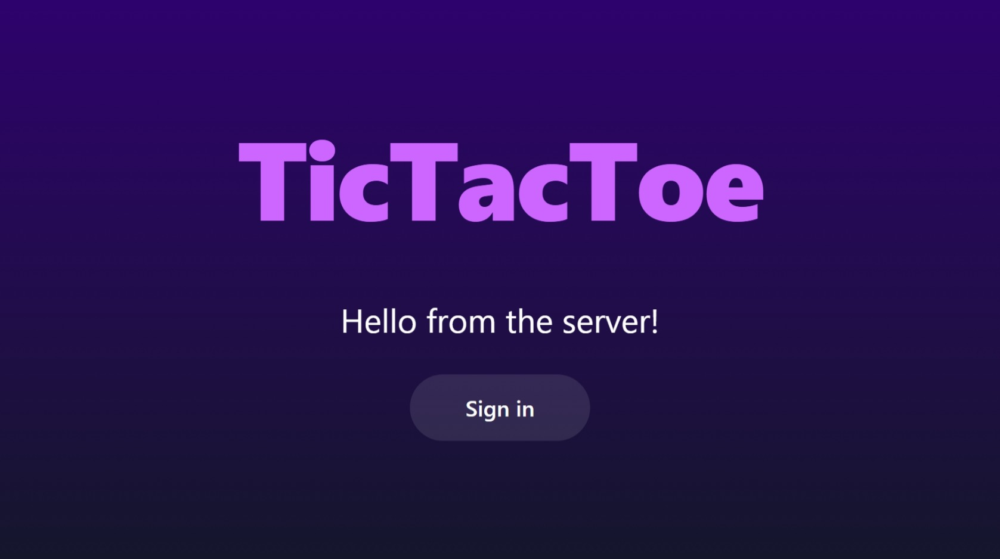

  <h1>TicTacToe</h1>
  <h3>Experience the classic game with a modern twist. Built with cutting-edge technologies for an immersive user experience.</h3>
  
   
   
  <figure>
  <!-- Smaller pcuture -->
    
    <figcaption>
      

        Experience the classic game of TicTacToe in a whole new light.
      

    </figcaption>
  </figure>

 

## Introduction
TicTacToe is a full-stack application that brings the classic game to your browser. It's built using industry-standard technologies and is hosted on Heroku for seamless deployment and scalability.

## Features
- 🎮 **Modern Tic-Tac-Toe Game**: Enjoy the classic game with a modern user interface and enhanced features.
- 🌐 **Real-Time PvP**: Play against other players in real-time for a more challenging experience.
- 🤖 **AI Games**: Play against an AI with three levels of difficulty, including a minimax algorithm for the ultimate challenge.
- 🔒 **Secure Login System**: Securely log in with your social accounts including Google, GitHub, and Discord.
- 📜 **Move History**: Keep track of every move in your games, with history saved to the database for future reference.

### Technologies
- 🎯 **Next.js**: A React framework that enables features like server-side rendering and generating static websites for React based web applications.
- 🔐 **nextAuth.js**: A complete open source authentication solution for Next.js applications.
- 🗃️ **Prisma**: An open-source database toolkit that provides a type-safe database client for TypeScript & Node.js.
- 🎨 **Tailwind CSS**: A utility-first CSS framework packed with classes like flex, pt-4, text-center and rotate-90 that can be composed to build any design, directly in your markup.
- 🚀 **tRPC**: A framework for building typesafe APIs, it enables end-to-end typesafe APIs with minimal setup.
- ☁️ **Heroku**: A cloud platform that lets companies build, deliver, monitor, and scale apps.

For more information about the technologies used in this project, please visit the [Technologies](docs/Technologies.md) page.
## Getting Started
To get started with the application, clone the repository and install the dependencies using `pnpm install`. You can then run the application in development mode using `pnpm run dev`.

## Documentation
- 📁 [Folder Structure](docs/Structure.md): Detailed explanation of the project's folder structure.
- 🚦 [tRPC Procedures/Routes](docs/Procedures.md): Detailed explanation of the tRPC procedures and routes used in the application.
- 📈 [Sequence Diagram](docs/SequenceDiagram.md): Understand the flow of the application when a user makes a move.
## License
This project is licensed under the terms of the GNU General Public License v3.0. See the `LICENSE` file for details.

## Acknowledgments
Thanks to the creators and contributors of Next.js, nextAuth.js, Prisma, Tailwind CSS, and tRPC for their amazing work in the open-source community.
