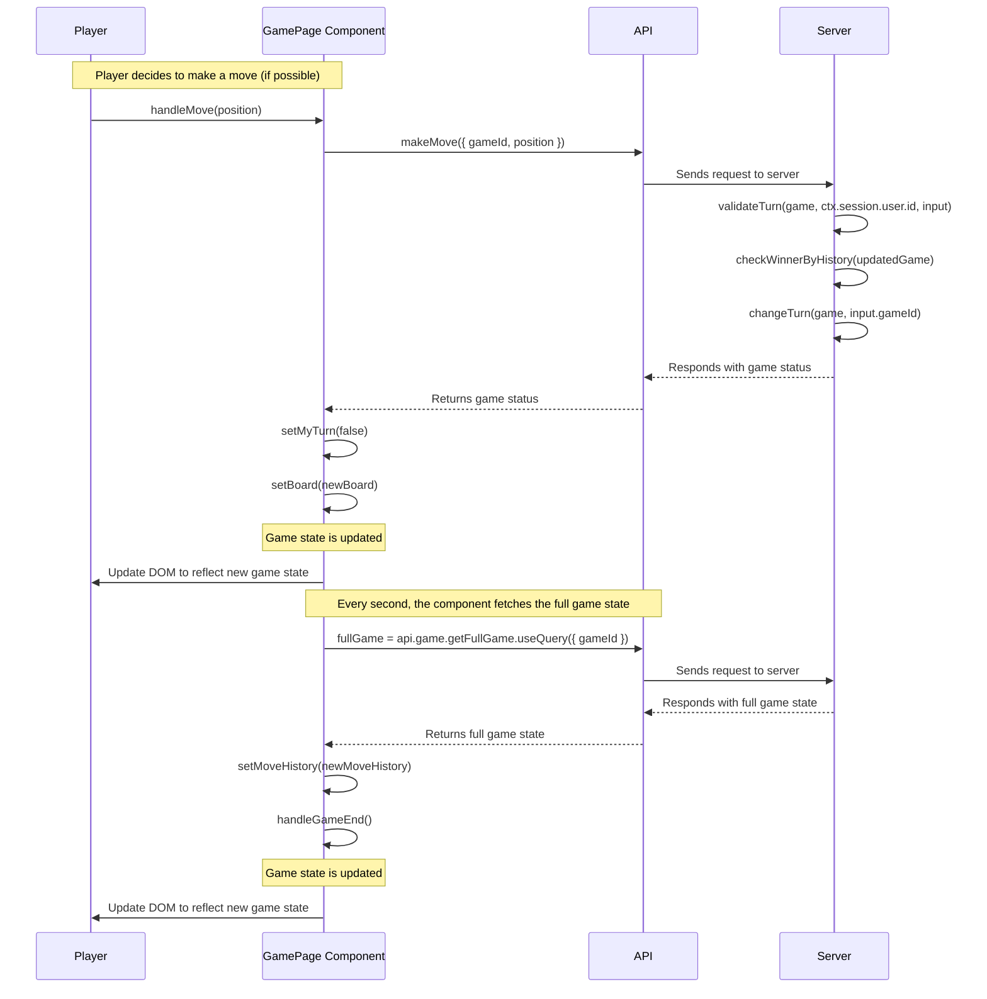

# Sequence Diagram

This document describes the sequence of method calls when a player makes a move in the game.

## Description

1. The player decides to make a move and calls the `handleMove` function with the chosen position as an argument.

2. The `handleMove` function checks if it's the player's turn and if the chosen position on the board is empty. If these conditions are met, it calls the `makeMove` function from the API with the game ID and the chosen position as arguments.

3. The `makeMove` function sends a request to the server to make a move in the game.

4. The server processes the request and responds with the updated game status.

5. The `makeMove` function returns the updated game status to the `handleMove` function.

6. The `handleMove` function updates the game state by setting `myTurn` to `false` and updating the board with the new move.

7. The GamePage component updates the UI to reflect the new game state.

8. Every second, the `GamePage` component fetches the full game state from the server using the `api.game.getFullGame.useQuery` function.

9. The server processes the request and responds with the full game state.

10. The `api.game.getFullGame.useQuery` function returns the full game state to the `GamePage` component.

11. The `GamePage` component updates the move history with the new moves from the full game state.

12. The GamePage component updates the UI to reflect the new move history.
